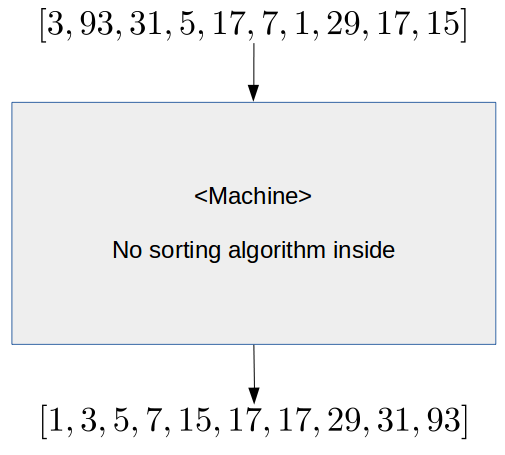
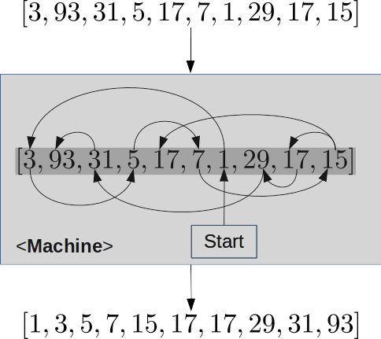
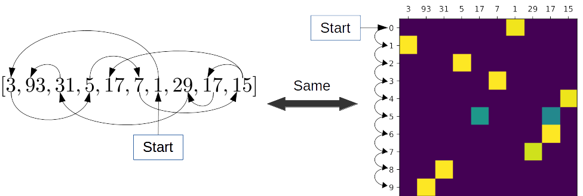
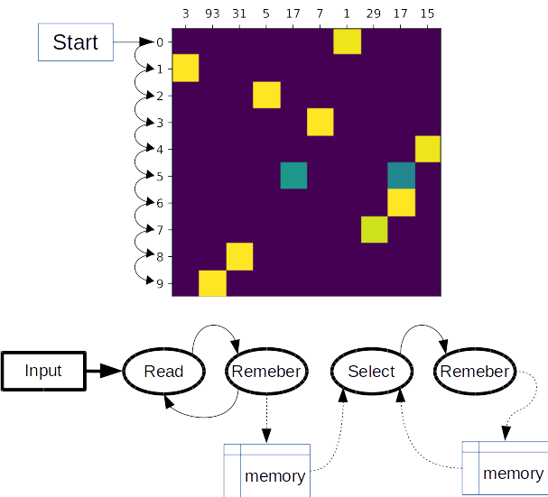

# Sequence to sequence with attention 

This work is the minimal pytorch implementation of some sequence to sequence models. Here I am describing:
* Loung seq2seq model: used in NLP sequence to sequence translation
* Pointer networks: an important piece in many combintorial neural networks.

## Keywords:
sequence to sequence ; Loung; NLP; optimization; Pointer networks

## Settings:
- pytorch 1.4.0
- python 3.7.6

## 1- Loung seq2seq model.
 We have used the date generation code from https://github.com/tensorflow/tfjs-examples/tree/master/date-conversion-attention to create a dataset and have followed the same steps in this link, but our implementation uses NLLoss instead of cat. softmax loss function. 
The current implementation is meant for learninig purposes and might not be effecient in terms of speed.

### To run:
  see `Loung_seq2seq_example.ipynb`

## 2- Pointer nets.
 This is simillar to the previouse model but in this case we use the softmax output to point back to the input. Thus making the output and input length consistent and removes the limitation in predefining a fixed output length. 

### Sorting numbers using pointer nets
 I will use number sorting example to demonstrate how pointer network works.

 Let us assume a pointer net is a blackbox machine, where we feed it with an array (sequence) of unsorted numbers. The machine sorts the input array. We are sure there is not any sorting algorithm (bubbles) inside the machine. How does it do it?

 

  
   <b> Figure 1 </b>

  
 Now assume we can obtain an estimation of what the machine actually does:

  
   <b> Figure 2 </b>

Each one of these arrows <b>points</b> to an item in the input. For each input the machine will generate a sequence of these arrows (<b>pointers</b>). Therefore, the mahine must learn a mechanisim that generates these arrows.

Let create a better representation that in <b>Figure 1</b> when using a hot-one encoding matrix. Where each row tells us which input (x axis) to point to in the current step (y axis).

  
   <b>Figure 3</b>

Where : yellow squares = 1, green = 0.5, blue =0.

Please note that, since there are two 17s in the input, we can point to any one of them with the same probability.

So far we have seen an estimation of the machine is doing, but is that we pointer networks actually does. To know the answer, let us construct another sketch of how did we as human do it:

1. read an item from the sequence. 
2. remeber it , why? Because we actually look for the smallest number. Therefore we need to remeber all number we have visisted
3. if the current item is the smallest number, then draw arrow to it.
4. remeber it, why? Because we will use it to find the second smallest number.

The above steps shows how we selected the first arrow in the <b>Figure 2</b>. 

We need to remeber both the input and the generated sequence so far. Therefore, we can the following components:

  
   <b>Figure 4</b>

The main component is <b>select</b> 

 ### To run:
  - see `pointer_net_example.ipynb` for unmasked pointer network 
  - see  `masked_pointer_net_example.ipynb` for masked pointer network, notice the radically improved performance!
  - see  `pointer_net_multi_features_example.ipynb` for masked pointer network used for input vector with higher dimensions.

# Links:
- [1] Loung model paper: 
- [2] Pointer network paper: https://arxiv.org/abs/1506.03134
- [3] TensorFlow 2.0 Impelementation : https://github.com/AndreMaz/deep-attention