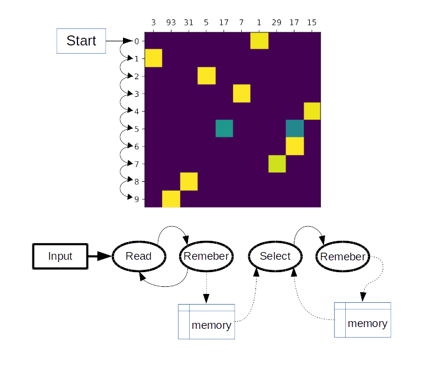

# Sequence to sequence (seq2seq) with attention 

This work is the minimal pytorch implementation of some sequence to sequence (seq2seq) models:
* Loung seq2seq model: used in NLP sequence to sequence translation
* Pointer networks: an important piece in many combinatorial neural networks.

This repo. is written in a none-technical way to explain the intuition behind these models. However, the code follows the papers that describe the models. A more technical description will be published soon.

## Keywords:
sequence to sequence ; Loung; NLP; optimization; Pointer networks

## Settings:
- pytorch 1.4.0
- python 3.7.6

## 1- Loung seq2seq model.
 We have used the date generation code from https://github.com/tensorflow/tfjs-examples/tree/master/date-conversion-attention to create a dataset and have followed the same steps in this link, but our implementation uses NLLoss instead of cat. softmax loss function. 
The current implementation is meant for learning purposes and might not be efficient in terms of speed.

### To run:
  see `Loung_seq2seq_example.ipynb`

## 2- Pointer nets.
 This is similar to the previous model but in this case we use the softmax output to point back to the input. Thus making the output and input length consistent and removes the limitation in predefining a fixed output length. 

### Sorting numbers using pointer nets
 I will use number sorting example to demonstrate how pointer network works.

 Let us assume a pointer net is a blackbox machine, where we feed it with an array (sequence) of unsorted numbers. The machine sorts the input array. We are sure there is not any sorting algorithm (bubbles) inside the machine. How does it do it?

 

  
   <b> Figure 1 </b>

  
 Now assume we can obtain an estimation of what the machine actually does:

  
   <b> Figure 2 </b>

Each one of these arrows <b>points</b> to an item in the input. For each input the machine will generate a sequence of these arrows (<b>pointers</b>). Therefore, the machine must learn a mechanism that generates these arrows.

Let create a better representation that in <b>Figure 1</b> when using a hot-one encoding matrix. Where each row tells us which input (x axis) to point to in the current step (y axis).

  
   <b>Figure 3</b>

Where : yellow squares = 1, green = 0.5, blue =0.

Please note that, since there are two <b>17</b>s in the input, we can point to any one of them with the same probability.

So far we have seen an estimation of what the machine is doing, but is that we pointer networks actually does. To know the answer, let us construct another sketch of how would human do it:
- Repeat these steps:
1. read an item from the sequence. 
2. remember it , why? Because we actually look for the smallest number. Therefore we need to remember all number we have visited
- After we have read and remembered all items from the input, we can start generating the arrows in <b>Figure 2</b>. Therefore we repeat the following steps until we generate all arrows:
1. pick the smallest number, then draw arrow to it.
2. remember it, why? Because we will use it to find the second smallest number.
 
> We need to remember both the input and the generated sequence so far. We actually use both memories to generate the next arrows. That is (memory(input), memory(output so far)) -> next arrow 

Therefore, we can the sketch the following components from the above steps:

  
   <b>Figure 4</b>

The main component is <b>select</b>, where it uses both the memory from the input side, and the memory from the output side to generate the next arrow. The <b>remember</b> component might have different preprocessing steps before it can store the data it receives.

Let us combine the components in the input side: <b>read</b>, <b>remember</b>, and <b>memory</b> and call it <i><b>Encoder</b></i>. Likewise, let us combine the components in the output side: <b>select</b>, <b>remeber</b>, and <b>memory</b> and call it decoder. Therefore, the pointer network is a neural network architecture that encodes the input and converts it into a latent memory and use a decoder step to generate a pointer to the input. 

However, the representation in <b>Figure 2</b> is what we actually tries to teach the pointer network. When trained it pointer network starts by making random guesses and improves with time until it obtains clear decisions. 

A training until convergence of pointer network is shown in <b>Figure 5</b>. This file is generated from `masked_pointer_net_example.ipynb`.

  
   <b>Figure 5</b>

### To test the code try:
  - see `pointer_net_example.ipynb` for unmasked pointer network 
  - see  `masked_pointer_net_example.ipynb` for masked pointer network, notice the radically improved performance!
  - see  `pointer_net_multi_features_example.ipynb` for masked pointer network used for input vector with higher dimensions.

# Links:
- [1] Loung model paper: https://arxiv.org/abs/1508.04025
- [2] Pointer network paper: https://arxiv.org/abs/1506.03134
- [3] TensorFlow 2.0 Impelementation : https://github.com/AndreMaz/deep-attention
